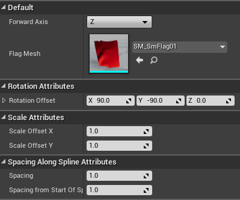

This post is meant to explain my approach to procedurally generating flags, and in theory, any mesh along a spline in UE4.

# Blueprint Breakdown

    

## The Problem

For the [Hollowed](http://store.steampowered.com/app/669630/Hollowed/) project, there was a need to have hanging flags. Initially level designers were placing flags against walls but didn't use context as to how they were hanging. My goal was to make a blueprint that could interchange flags and have them hang from a rope mesh.

## My Solution

The Red Section of the blueprint shows how I connected a cylindrical mesh to serve as the "rope" the flags would be hanging from. The cylindrical mesh runs along the spline by making the cylindrical mesh's Z the forward axis when it is attached to the spline. The cylindrical mesh runs from one spline point to the next and by having a simple material, the rope implies it is a seemless mesh.

​
The flag meshes are attached to and generated along the spline. Each flag mesh attaches to the spline at the mesh's pivot point. After some trial and error it became apparent that the orientation of the spline could make attached flag meshes not make sense in a level. To combat this I added several exposed variables to allow the user to position the flags as desired.

As shown in Green section of the blueprint. The spacing value determines the spacing along the spline between each flag mesh. Since each mesh used for this blueprint had their pivot in the center of the mesh, I also had to add an offset to push the first flag within the length of the cylindrical mesh. After each flag is placed, the rotation and scale parameters can be used to orient how the flags hang from the cylindrical mesh.

