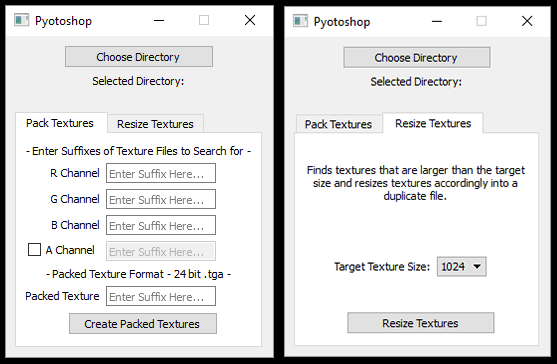

I have joined a few freelance projects where it was necessary to purchase asset packs to expedite the development process. Texture files seemed to come in varying sizes and quality. To reduce performance costs I have had to manually resize several textures both inside and outside of the game engine. This is a tedious process and I started thinking it should be possible to automate this process.

I created a standalone Python exe that would open Photoshop perform the operations and used PyQt to make the GUI. My goal was to make a tool that can take seperate textures and pack them together into a new texture and also resize textures.

This exe was aptly named 'Pyotoshop'...hokey, I know but makes me laugh when I think about it.

Link to the Github [repo](https://github.com/douglascomet/PythonPhotoshop) for this project

# Contents

* os.walk vs scandir.walk
* Comtypes
* Python Syntax for Photoshop
* PyQt

## os.walk vs scandir.walk

First thing I want to go over is how I went about traversing directories and files. Most examples online say to use os.walk to do this. This is the typical format for os.walk:

```python
for root, sub_directories, file_name os.walk(directory):
```

The way os.walk works is that it will inherently iterate over the root directory, all the sub directories, and all the files. After it completes its iterations it generates lists for everything it found in each directory. The problem with this method is if you plan to do any operations within this loop the runtime gets higher and higher.

After some reaserch I came across scandir.walk. The scandir package was developed by Ben Hoyt and incorporated into Python 3.5. He wrote a blogpost about it, found [here](http://benhoyt.com/writings/scandir/), and discusses how scandir.walk out performs and is quicker than os.walk. Luckily it can be added to Python 2.7 by using: pip install scandir

The output of scandir.walk is a tuple for each directory.
Tuple Indexes:
* [0] {string}- directory path
* [1] {list} - list of sub directories
* [2] {list} - list of files in the directory path

Rather than using tuple indecies in my code I decided to transfer the values to a dictionary with identifiable keys as shown here:

```python
def scandir_to_dict(cls, path):
    # list of dictionaries
    scandir_entries = []

    # walk through directory, sub directories, and files
    for entry in scandir.walk(path):
        temp = {'Directory': '', 'Sub_Dirs': [], 'Files': []}
        temp['Directory'] = entry[0]
        temp['Sub_Dirs'] = entry[1]
        temp['Files'] = entry[2]

        scandir_entries.append(temp)

    return scandir_entries
```

The output of this function was a list of dictionary with easy to use keys and organized data.

## Conmtypes

I started researching how to use Python to control Photoshop. Adam Pletcher's [blog post](https://techarttiki.blogspot.com/2008/08/photoshop-scripting-with-python.html) was one of the first hits I got off Google. Adam utilizes the win32com.client.

```python
import win32com.client
```

In the 10 years since this Adam's blog post, both Operating Systems and Photoshop are now 64 bit based. Evan McCall has a detailed [blog post](https://evanmccall.wordpress.com/2015/03/09/how-to-develop-photoshop-tools-in-python/) that details the difference between win32com and the more modern comtypes.

```python
import comtypes.client
```

The comtypes package documentation is located [here](https://pypi.python.org/pypi/comtypes) and are defined as a lightweight Python COM package that is able to define, call, and implement custom and dispatch-based COM interfaces.

Comtypes can be downloaded via pip using: pip install comtypes

Peter Hensha showcases in his [blog post](https://peterhanshawart.blogspot.com/2012/05/python-and-photoshop-code-snippets.html) how to utlize comtypes.client to control Photoshop. I have also seen posts on StackOverflow and Tech-Artists.org to use comtypes to control Word, Excel, and even After Effects.

## Python Syntax for Photoshop

With these posts as a basis, I began my own attempt at using Python to control Photoshop to deal with repetative tasks. Adam Pletcher suggested in his blog post to refer to the Visual Basic scripting guide for Photoshop. I found myself to bounce between the Visual Basic and Javascript examples. The documentation on Photoshop scripting can be found [here](https://www.adobe.com/devnet/photoshop/scripting.html).

To open Photoshop I used this syntax:

```python
 def launch_photoshop(self):
    ps_app = comtypes.client.CreateObject(
        'Photoshop.Application', dynamic=True)

    ps_app.Visible = True

    # Set the default unit to pixels!
    ps_app.Preferences.RulerUnits = 1

    return ps_app
```

The comtypes searches for and creates an object of the application that matches the string input. The 'dynamic=True' parameter means it makes the best guess for the available version of Photoshop on the system. I stumbled upon this StackOverflow thread using comtypes for Excel, found [here](https://stackoverflow.com/questions/685589/problem-using-python-comtypes-library-to-add-a-querytable-to-excel), which used that attribute. I tested this attribute in my script on computers that only have 1 version of Photoshop installed; however, this syntax works with Photoshop CC 2017, CC 2018 and CS6. If there are multiple versions of Photoshop installed on a computer then Photoshop version would need to be specified in the execution.

Here is what my PyQt UI looks like:



It is broken up by a QTabWidget where the user can choose which tool set to use.

### Packing Textures

To pack a texture, grey textures are copied into the RGB or RGBA channels of a new texture. The script will search for matches from the input QLineEdits and suffixes in the file names.

So the comtypes.client object is used to open a texture document and that is saved to a variable. I ged the width and height of the texture, select the contents of, what should only be 1 layer in the document, top layer, and then copy the contents. Then the I create a new document using the width and height values, set the new documents active channel to the specified channel, and then paste into that channel.

```python
# open texture matching designated suffix to be used for R Channel
r_doc = ps_app.Open(file_path)

# get width and height of texture
doc_width = r_doc.width
doc_height = r_doc.height

# selec and  copy contents of the layer in focus
r_doc.selection.selectAll()
r_doc.activeLayer.Copy()

# use height and width variables to create new texture
# with same resolution
blank_doc = ps_app.Documents.Add(
    doc_width, doc_height, 72, 'new_document', 2, 1, 1)

# blank_doc.channels['Red'] - equivalent to calling channel by name
# activeChannels must receive an array
blank_doc.activeChannels = [blank_doc.channels['Red']]
blank_doc.Paste()
```

The active channels are defined as an array of channels, therefore to get the right channel it can be selected by name.

Each time a document is opened in code, not specifically Python, it becomes the active document. So after I created a new document and then opened, for example, the texture I wanted to copy/paste into the green chanel I would have to use this syntax to change the active document:

```python
ps_app.activeDocument = blank_doc
```

And when I was done with a file I would use this syntax:

```python
# close original textures without saving
r_doc.Close(2)
```

### Resizing Textures

When it came to resizing textures, I thought it would be best to analyze which textures needed to be resized rather than resizing all textures. So the user is able to choose a size and the script will find all textures larger than that size, collect all the textures that is true for and then resize those textures.

To determine which textures needed to be resized I used the [Pillow](https://www.blog.pythonlibrary.org/2016/10/07/an-intro-to-the-python-imaging-library-pillow/) package. Pillow is a forked project from the PIL project which has not been updated since 2009. To install Pillow use: pip install Pillow

With Pillow I can access information of image files, like .jpg, .png, and .tga. Pillow can do a lot of photo manipulation with simpler formats like .jpg and .png but not .tga.

Using this syntax I was able to open image files and then access their dimensions. I also did checks to make sure if the textures were power of 2 as most textures for film and game should be. Sometimes this isn't the case but I did add consideration for that yet.

```python
# use PIL package to create Image object
with Image.open(current_file_path) as image:
    # size_of_image returns tuple (width, height)
    size_of_image = image.size
```

Here is my process for opening a document, resizing, saving it out, and closing the document:

```python
# open texture file in Photoshop
current_ps_doc = ps_app.Open(texture_path)

# incase Photoshop was already open, make current
# document the active document
ps_app.Application.ActiveDocument

# call the Photoshop resize operation
current_ps_doc.resizeImage(target_resolution, target_resolution)

# call function to Save As the resized texture
self.save_as(ps_app, current_ps_doc, new_file_name)

# close original version without saving
current_ps_doc.Close(2)
```

I followed a similar format as when I was packing textures. The new opeartion of resizing an image was one line of code where I used the same value for height and width. Here however I show that I am calling a 'self.save_as' function, which I did not show earlier.

When using comtypes and saving out an image from Photoshop, another comtypes object needs to be created for each format intended to be exported. So my 'self.save_as' is a buffer function that checks which format I intend to export than goes to another function to complete the export.

Here is the syntax I used to export .tga's:

```python
# creates com object for tga save operation
tga_save_options = comtypes.client.CreateObject(
    'Photoshop.TargaSaveOptions', dynamic=True)
tga_save_options.Resolution = 24
tga_save_options.AlphaChannels = False
tga_save_options.RLECompression = False

# If designated to include alpha, set parameters to do so
if alpha_channel:

    tga_save_options.Resolution = 32
    tga_save_options.AlphaChannels = True

# Photoshop saves texture as tga
ps_app.ActiveDocument.SaveAs(tga_file, tga_save_options, True)
```

For exporting .jpg's and .png's I used the default settings. While in the .tga's I chose to specify some attributes.

## PyQt - QProgressBar

After being able to successfully pack and resize textures I noticed that I had no visual indication for the user the progress of the textures being processed. So I looked into how to implement how to use a QProgressBar.

Here is the syntax I used when using PyQt4:

```python
# Creates the QProgressDialog Window
progdialog = QtGui.QProgressDialog('', 'Cancel', 0, progress_length)

# Sets window title
progdialog.setWindowTitle(window_title)

# Keeps the window on top of all other windows
progdialog.setWindowFlags(QtCore.Qt.WindowStaysOnTopHint)

# Show window
progdialog.show()
```

And then inside the loop that I performed other operations I would manipulate the progdialog with these attributes:

```python

progress_dialog.setValue(current_index)

progress_dialog.setLabelText('Packing %s...' % new_file_name_path)

if progress_dialog.wasCanceled():
    break
```

And after the loop was finished:

```python
progress_dialog.setValue(progress_length)

progress_dialog.close()
```

Making this tool had me thinking about the user experience so I tried to make it clear for the user how to use the tool and what the tool was doing. The only other thing I want to include is some help documentation but I could not find a way that works simply.
